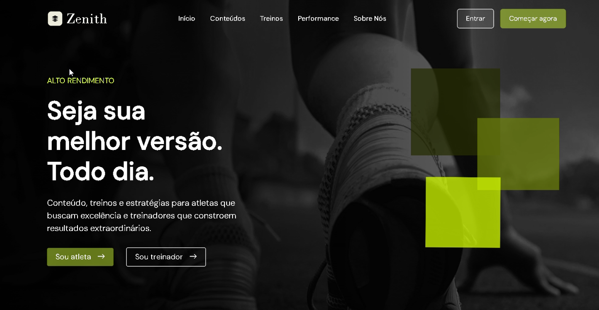

# Zenith | Plataforma Esportiva
Projeto de design de plataforma fitness completa, desenvolvido no Figma, com foco em atletas, treinadores e nutricionistas.

A Zenith é uma plataforma esportiva que conecta atletas, treinadores e nutricionistas em um único ambiente. Nela, atletas acompanham seus treinos e métricas corporais, treinadores gerenciam suas equipes e nutricionistas monitoram as dietas dos atletas de forma individualizada.

O projeto contempla **i)** uma landing page institucional; **ii)** fluxo de login por perfil; **iii)** dashboards por tipo de usuário e **iv)** telas de métricas, treinos e dieta.

# Desenvolvimento até o momento:
[](https://mkevin2.github.io/ZenithApp-Video/)

---------------------

### Infraestrutura necessária:
- [.NET SDK 8+](https://dotnet.microsoft.com/download)
- [VS Code](https://code.visualstudio.com/)
- [MySQL Workbench](https://www.mysql.com/products/workbench/)

---------------------

### Como usar:

**1. Escolher o template correto**

Ao criar o projeto, selecione:
> **ASP.NET Core Web App (Model-View-Controller)**

⚠️ Não escolha: `API`, `Blazor` ou `Vazio`. O template MVC já vem com a estrutura pronta.

---------------------

**2. Nome e pasta do projeto**

Quando solicitado, informe:
- **Nome** → ex: `ZenithApp`
- **Pasta** → escolha o diretório onde deseja salvar

---------------------

**3. Configurações do projeto**

- **Framework** → escolha o mais recente (ex: `.NET 8`)
- **Authentication** → `None` (por enquanto)
- **HTTPS** → pode deixar ativado

---------------------

**4. Abrir o projeto no VS Code**

Após a criação, clique em **Open Folder** no VS Code e abra a pasta do projeto.

---------------------

**5. Rodar o projeto pela primeira vez**

Abra o terminal no VS Code e execute:
```bash
dotnet run
```
> Caso não esteja na pasta do projeto, navegue até ela antes:
> ```bash
> cd NomeDoProjeto
> ```
> Se tudo der certo, aparecerá no terminal o link local para acessar o projeto no navegador.

---------------------

**6. Entendendo a estrutura MVC**

Dentro do projeto você encontrará:

- 📁 `Controllers/` — lógica da aplicação (ex: `HomeController.cs`)
- 📁 `Models/` — representação dos dados (ex: Usuário, Treino, Dieta)
- 📁 `Views/` — parte visual em HTML + Razor (ex: `Views/Home/Index.cshtml`)

---------------------

### Perfis de usuário:
- **Atleta**: acessa seus treinos semanais, métricas corporais e dieta personalizada.
- **Treinador**: visualiza e gerencia os atletas vinculados, acompanha treinos e progresso.
- **Nutricionista**: cria e monitora dietas individuais para cada atleta.

### Telas principais:
- `Landing Page`: apresentação da plataforma com seções de serviços, contatos e call-to-action.
- `Login`: tela de autenticação com seleção de perfil (Atleta, Treinador ou Nutricionista).
- `Cadastro`: formulário de criação de conta por tipo de usuário.
- `Dashboard do Atleta`: exibe treinos da semana separados por dia e categoria.
- `Métricas do Atleta`: registros corporais (idade, altura, peso, biotipo, composição corporal) e de performance (força, velocidade, cardio).
- `Dieta do Atleta`: refeições diárias montadas pelo nutricionista, separadas por período do dia.
- `Dashboard do Treinador`: lista de atletas disponíveis com acesso a treinos e progresso.
- `Dashboard do Nutricionista`: lista de atletas com opção de criar e editar dietas.

### Diagrama de classe:


### Diagrama de casos de uso:

